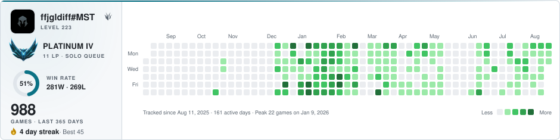

# lol-contribution-graph

[](https://github.com/MisTraleuh/lol-contribution-graph/actions/workflows/update.yml)


**A GitHub-style contribution graph for your League of Legends games, embeddable in any README.**

Every green square is one day of games. Around the heatmap, the card shows your official
ranked emblem, LP and win rate, your summoner icon, level and most played role, plus your
play streaks. A GitHub Action refreshes everything every 30 minutes, straight from the
Riot API.

<picture>
  <source media="(prefers-color-scheme: dark)" srcset="graphs/ffjgldiff-mst-dark.svg">
  
</picture>

## Quick start

**1. Create your own copy**

[MisTraleuh/lol-contribution-graph](https://github.com/MisTraleuh/lol-contribution-graph)
→ **Use this template** → *Create a new repository*

Or simply [fork the repo](https://github.com/MisTraleuh/lol-contribution-graph/fork).
Everything below happens in your copy.

**2. Get a Riot API key**

[developer.riotgames.com](https://developer.riotgames.com) → sign in with your Riot
account → *Dashboard* → *Register Product* → **Personal API Key**

Free, no expiration. The development key shown on the dashboard also works for a quick
test, but it expires every 24 hours, which breaks the scheduled refresh.

**3. Store the key as a repository secret**

Your forked repo, the copy from step 1 → *Settings* → *Secrets and variables* → *Actions* →
**New repository secret** → name it `RIOT_API_KEY` → paste your key

With the GitHub CLI: `gh secret set RIOT_API_KEY`.

**4. Configure your player(s)**

Edit [`config.json`](config.json):

```json
{
  "players": [
    { "gameName": "ffjgldiff", "tagLine": "MST", "region": "euw1" }
  ],
  "days": 365,
  "timezone": "Europe/Paris",
  "queue": null
}
```

**5. Enable the workflow and run it once**

Your forked repo, the copy from step 1 → *Actions* → **I understand my workflows, go ahead and enable them** →
*Update graphs* → **Run workflow**

The first run backfills a full year of games, which takes about 8 minutes per player.
Later runs take a few seconds and happen automatically every 30 minutes.

**6. Embed the card**

```html
<picture>
  <source media="(prefers-color-scheme: dark)" srcset="graphs/ffjgldiff-mst-dark.svg">
  
</picture>
```

To display the card in another repository, for example your GitHub profile README,
your copy must be public. Then use the raw URL:
`https://raw.githubusercontent.com/<you>/lol-contribution-graph/main/graphs/<player>-light.svg`

## Features

- GitHub-style heatmap of your games over the last 365 days, in light and dark themes
- Official ranked emblem with division, LP, win rate donut and season record
- Summoner icon, level and most played role, sampled from your last 20 matches
- Current streak, longest streak, peak day and active day count
- Several players in one repo, one card per player
- Python standard library only, nothing to install
- History cached in the repo, so your graph outlives the Riot API retention window

## How it works

```
Riot API -> data/history.json -> graphs/<player>-<theme>.svg -> committed by the Action
```

- The heatmap needs no per-match calls: games are counted with `match-v5` using one
  day-sized `startTime`/`endTime` window per request. A full-year backfill costs about
  365 requests and every later refresh only re-checks the last 3 days. This stays far
  below the personal key rate limits (100 requests per 2 minutes).
- `league-v4` provides your ranked tier, LP, wins and losses. `summoner-v4` provides
  your profile icon and level.
- Your most played role comes from the details of your last 20 matches. Roles are
  cached per match in the history file, so a refresh only fetches the games played
  since the previous run.
- Counts accumulate in [`data/history.json`](data/history.json): the graph keeps its
  history even once the Riot API no longer returns those matches.
- Ranked emblems and profile icons come from CommunityDragon and Data Dragon. They are
  cached in [`assets/`](assets/) and embedded into the SVG as base64, since GitHub
  blocks external images inside README SVGs.

## Configuration

| Key | Description |
| --- | --- |
| `players` | One entry per player, one card each. `gameName` and `tagLine` form your Riot ID (the part before and after the `#`). |
| `region` | Platform id: `euw1`, `eun1`, `na1`, `kr`, `br1`, `jp1`, `la1`, `la2`, `oc1`, `tr1`, `ru`, `me1`, `ph2`, `sg2`, `th2`, `tw2`, `vn2` |
| `days` | Size of the window shown in the heatmap. Default: `365`. |
| `timezone` | IANA timezone used to decide which day a game belongs to. Default: `UTC`. |
| `queue` | Optional [queue id](https://static.developer.riotgames.com/docs/lol/queues.json) filter: `420` solo/duo, `440` flex, `450` ARAM. `null` counts every game. |

## Update frequency

**Your data is refreshed every 30 minutes** (`cron: "*/30 * * * *"` in
[`.github/workflows/update.yml`](.github/workflows/update.yml)). Every run:

- re-counts your games over the last 3 days, so a game shows up on the heatmap within
  half an hour of being played
- refreshes your rank, LP, win rate and season record
- refreshes your profile icon, level and most played role
- re-renders both SVGs and commits them, so the card in your README is always current

Adjust the cron expression to taste, for example `0 5 * * *` for a single daily run at
05:00 UTC. Two things worth knowing:

- On a private repository, every run consumes GitHub Actions minutes. A 30 minute
  schedule uses roughly 1500 minutes per month, and the free plan includes 2000.
  Public repositories get unlimited Actions minutes.
- GitHub can delay scheduled runs by a few minutes when its runners are busy.

## Run it locally

Python 3.9 or newer, nothing to install:

```sh
export RIOT_API_KEY=RGAPI-...   # or write RIOT_API_KEY=... in a .env file
python3 src/main.py
```

`python3 src/main.py --demo` renders `graphs/demo-*.svg` from fake data, no key needed.

## FAQ

**Why are some squares faded?**
Those days are older than your tracking window. There is no data for them, which is
different from a day with zero games.

**A game seems counted on the wrong day.**
Games are bucketed by their start time in the configured `timezone`. A game started at
23:50 counts for that day, even if it ended after midnight.

**What about ARAM and other modes?**
Every LoL game counts in the heatmap by default (use `queue` to filter). Role detection
ignores modes without roles, such as ARAM and Arena.

**I am unranked.**
The card shows solo queue first, then flex, and falls back to an "Unranked" label
without the win rate donut when you have no ranked games this season.

**Can I track my friends too?**
Yes. Add them to `players` and each of them gets their own card in `graphs/`, all
updated by the same workflow.
